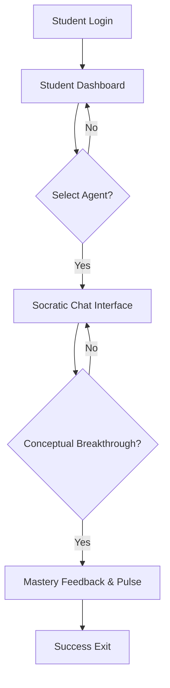

# 01-Socratic-Learning-Journey

**Project:** GenEd Portal  
**Created:** 2026-04-20  
**Method:** Whiteport Design Studio (WDS)

---

## Scenario Overview

**User Journey:** Student 'awakens' a subject agent from the Council Row and engages in a Socratic session to master a concept.

**Entry Point:** Student Dashboard  
**Success Exit:** Socratic Chat Interface (Mastery event achieved)  
**Alternative Exits:** Session paused, student navigates away.

**Target Personas:** Arjun (Younger Student), Elder Students.

---

## Pages in This Scenario

| Page # | Page Name | Status | Purpose |
| ------ | ----------- | ---------------- | --------------- |
| 01.1 | Student Dashboard | draft | Main entry point for students with the Council Row of agents. |
| 01.2 | Socratic Chat Interface | draft | Interactive learning session with the selected subject agent. |

---

## User Flow



---

## Scenario Steps

### Step 1: Subject Activation Ceremony

**Page:** 01.1-Student-Dashboard  
**User Action:** Clicks a subject agent icon (e.g., Math Owl) in the Council Row.  
**System Response:** Performs a 2px Emerald 'Awakening' pulse and redirects to Chat.  
**Success Criteria:** Student is successfully transitioned to the subject-specific chat.

### Step 2: Socratic Dialogue

**Page:** 01.2-Socratic-Chat-Interface  
**User Action:** Responds to the agent's guiding question (Text or Voice).  
**System Response:** Validates response and asks the next provocation or provides a 'Glow-Fill.'  
**Success Criteria:** Student reaches the 'Aha!' moment and masters the node.

---

## Success Metrics

**Primary Metric:** Rate of Socratic provocations successfully resolved without revealed answers.

**Secondary Metrics:**

- Time to 'Awaken' an agent from the dashboard.
- Percentage of correct conceptual links per session.

---

## Technical Requirements

### Data Flow

```
{Login} → [Fetch Student Profile] → {Dashboard} → [Select Agent] → [Init Chat Session] → {Chat} → [Post Response] → [Validate] → {Success/Feedback}
```

### API Endpoints Used

| Endpoint | Page(s) | Purpose |
| --------------- | ----------- | -------------- |
| `/api/socratic/prompt` | 01.2 | Get the next Socratic question or feedback. |
| `/api/student/mastery` | 01.1, 01.2 | Fetch or update student's mastery status. |

---

## Design Assets

**Scenario Folder:** `C-UX-Scenarios/01-Socratic-Learning-Journey/`

**Page Specifications:**

- 01.1-Student-Dashboard/Student-Dashboard.md
- 01.2-Socratic-Chat-Interface/Socratic-Chat-Interface.md

---

## Revision History

| Date | Changes | Author |
| ------ | ------------------------ | -------- |
| 2026-04-20 | Initial scenario created | Freya |

---

_Created using Whiteport Design Studio (WDS) methodology_
