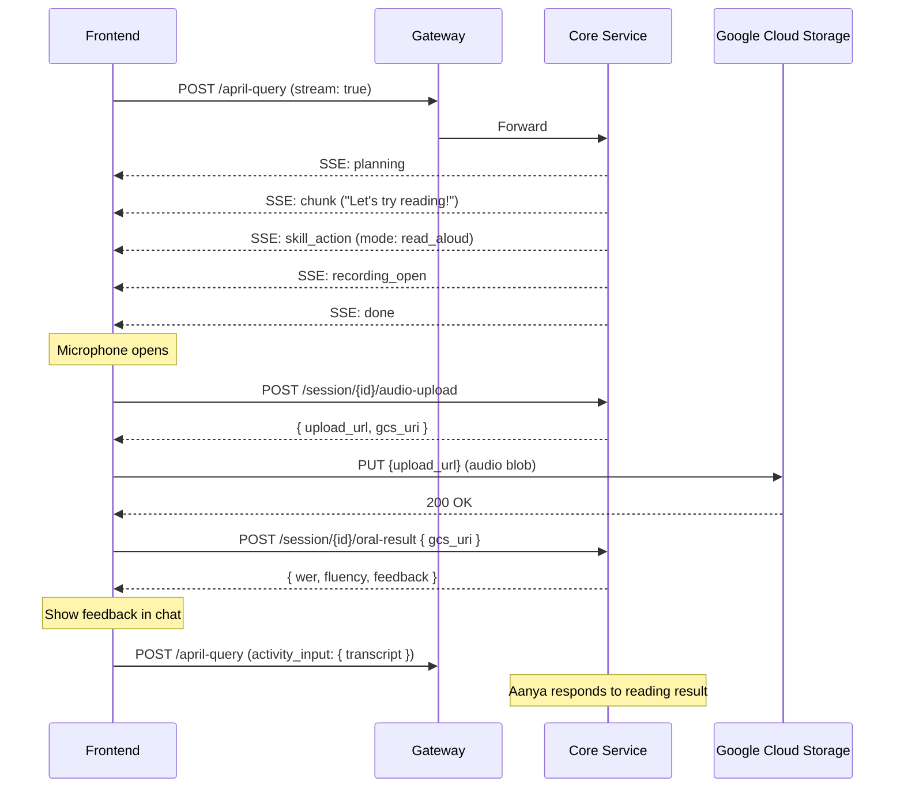

# KIRA English Skills — Complete UI Integration & Testing Spec

> **Purpose:** Everything your frontend developer needs to integrate and test all 6 English skill modes.
> All URLs go through the gateway (`/api/...` or direct to core-service). No prefix stripping needed — gateway forwards paths as-is to core-service.

---

## 1. Primary API: The Conversation Stream

**Everything starts here.** The frontend calls `/april-query` with `stream: true`. The backend responds with Server-Sent Events (SSE). English skill modes are triggered as SSE events mid-stream.

### Request

```
POST /april-query
Content-Type: application/json
```

```json
{
  "student_id": "a4d9603a-...",
  "session_id": "b5417700-...",
  "text": "I'll read",
  "stream": true,
  "subject": "English",
  "intent": "learn",
  "grade": 5,
  "agent_id": "KIRA"
}
```

### SSE Event Types the Frontend Must Handle

| SSE Event Type | When It Fires | What Frontend Does |
|---|---|---|
| `planning` | Immediately on request | Show "Thinking..." indicator |
| `chunk` | As Aanya types her response | Append text to chat bubble (streaming) |
| `skill_action` | When an English mode is triggered | **Route to the correct mode handler** (see below) |
| `tts_start` | Paired with `speak_para` skill_action | Start audio playback + word highlighting |
| `recording_open` | Paired with `read_aloud` / `karaoke` | **Open microphone**, show recording UI |
| `skill_result` | After oral-result or comprehension submission | Show feedback/score |
| `skill_error` | If a mode is disabled or fails | Show graceful fallback |
| `heartbeat` | Every few seconds during long processing | Keep connection alive (ignore) |
| `done` | Stream complete | **Finalize chat bubble**, update session state |

---

## 2. Mode-by-Mode Specification

---

### Mode 1 — Para/Stanza-wise Reading (`speak_para`)

**Behavioral Spec:** Aanya reads 1–2 paras/stanzas aloud. Text highlights word-by-word as she speaks. After each unit, she pauses and asks a comprehension question.

#### SSE Events Received (in order)

**Event 1: `skill_action`**
```json
{
  "type": "skill_action",
  "directive_id": "dc85ba58-...",
  "mode": "speak_para",
  "payload": {
    "source_text": "He can't read the newspaper...",
    "para_index": 1,
    "total": 2,
    "highlight": true,
    "directive_id": "dc85ba58-..."
  }
}
```

**Event 2: `tts_start`**
```json
{
  "type": "tts_start",
  "directive_id": "dc85ba58-...",
  "estimated_ms": 4500,
  "timepoints": [
    { "word": "He", "time_seconds": 0.0 },
    { "word": "can't", "time_seconds": 0.25 },
    { "word": "read", "time_seconds": 0.5 }
  ]
}
```

#### Frontend Actions

1. Display `source_text` in a styled text block
2. Fetch audio: `GET /audio/tts?directive_id=dc85ba58-...` with header `X-User-Id: {student_id}`
3. Play audio, highlight words using `timepoints` array
4. On playback complete, send conversation action:

```
POST /session/{session_id}/conversation-action
```
```json
{
  "type": "playback_complete",
  "directive_id": "dc85ba58-...",
  "timestamp": "2026-05-14T12:00:00Z"
}
```

#### Audio API Response
Returns `audio/mpeg` streaming body. Headers: `X-Directive-Id`, `Cache-Control: no-store`.

#### Student Controls
| Control | Action |
|---|---|
| Repeat | POST conversation-action with `type: "repeat_requested"` |
| Slower | POST conversation-action with `type: "slower_requested"` |
| Skip | POST conversation-action with `type: "interaction_skipped"` |

---

### Mode 2 — Difficult Word Pronunciation (`difficult_word`)

**Behavioral Spec:** Specific words become tappable. Tap gives pronunciation, slower pronunciation, syllable split. Only grade-appropriate difficult words — not every word.

#### SSE Event Received

```json
{
  "type": "skill_action",
  "directive_id": "abc123-...",
  "mode": "difficult_word",
  "payload": {
    "word": "newspaper",
    "syllables": ["news", "pa", "per"],
    "phonetic": null,
    "slow_available": true,
    "directive_id": "abc123-..."
  }
}
```

#### Frontend Actions

1. Make the word tappable in the displayed text
2. On tap, show syllable breakdown from `payload.syllables`
3. Play pronunciation:

**Normal speed:**
```
GET /audio/word-tts?word=newspaper&grade=5&slow=false
Header: X-User-Id: {student_id}
```

**Slow speed:**
```
GET /audio/word-tts?word=newspaper&grade=5&slow=true
Header: X-User-Id: {student_id}
```

#### Audio API Response
Returns `audio/mpeg` streaming body. Header `X-Word-TTS-Cache: hit|miss`.

#### UX Rules
- Max 3 difficult words per turn
- Audio controls stay visually subtle — reading is primary
- Speaker icon on every response bubble for full playback

---

### Mode 3 — Student Reads Aloud (`read_aloud`)

**Behavioral Spec:** Student reads text aloud. Microphone opens automatically. Aanya chooses reading unit (word/sentence/paragraph) based on grade and fluency. Feedback is gentle, never interrupts mid-unit.

#### SSE Events Received (in order)

**Event 1: `skill_action`**
```json
{
  "type": "skill_action",
  "directive_id": "def456-...",
  "mode": "read_aloud",
  "payload": {
    "source_text": "The boy ran quickly through the field.",
    "mode": "sentence",
    "directive_id": "def456-..."
  }
}
```

**Event 2: `recording_open`**
```json
{
  "type": "recording_open",
  "directive_id": "def456-...",
  "mode": "sentence",
  "expected_duration_ms": 15000
}
```

#### Frontend Actions — Recording Flow (3 steps)

**Step 1: Get signed upload URL**
```
POST /session/{session_id}/audio-upload
Header: X-User-Id: {student_id}
```
```json
{
  "directive_id": "def456-...",
  "mime_type": "audio/webm",
  "file_size_bytes": 524288,
  "codec": "opus"
}
```

**Response:**
```json
{
  "upload_url": "https://storage.googleapis.com/bucket/path?X-Goog-Signature=...",
  "gcs_uri": "gs://bucket/english-skills/student-id/session-id/def456_recording.webm",
  "expires_at": "2026-05-14T12:10:00Z",
  "content_type": "audio/webm",
  "max_size_bytes": 15728640,
  "method": "PUT",
  "headers": { "Content-Type": "audio/webm" }
}
```

**Step 2: Upload audio directly to GCS**
```
PUT {upload_url}
Content-Type: audio/webm
Body: <raw audio bytes>
Headers: (use headers from response above)
```

**Step 3: Submit for analysis**
```
POST /session/{session_id}/oral-result
Header: X-User-Id: {student_id}
```
```json
{
  "directive_id": "def456-...",
  "gcs_uri": "gs://bucket/english-skills/student-id/session-id/def456_recording.webm"
}
```

**Response: `OralReadingAnalysisResponse`**
```json
{
  "directive_id": "def456-...",
  "wer": 0.12,
  "pace_wpm": 85.5,
  "fluency": "good",
  "feedback": "Great reading! You paused nicely at the comma.",
  "difficult_words": ["quickly"]
}
```

#### UX Rules
- Default unit: sentence. Student can switch via `Word | Sentence | Paragraph` controls
- If student pauses unusually long, Aanya assists ("Want me to help with this sentence?")
- Feedback tone: encouraging. Never "wrong", "failed", or "bad recording"
- `mode` field in payload can be: `"word"`, `"sentence"`, or `"paragraph"`

---

### Mode 4 — Karaoke / Repeat After Me (`karaoke`)

**Behavioral Spec:** Student speaks first, always. After attempt, student gets option to hear Aanya's version. Attempt before model — not simultaneous.

#### SSE Events Received (identical structure to read_aloud)

**Event 1: `skill_action`**
```json
{
  "type": "skill_action",
  "directive_id": "ghi789-...",
  "mode": "karaoke",
  "payload": {
    "source_text": "He checked inside his pockets, He glanced under his chair.",
    "mode": "sentence",
    "directive_id": "ghi789-..."
  }
}
```

**Event 2: `recording_open`**
```json
{
  "type": "recording_open",
  "directive_id": "ghi789-...",
  "mode": "sentence",
  "expected_duration_ms": 15000
}
```

#### Frontend Actions — Same 3-step recording flow as Mode 3

1. `POST /session/{session_id}/audio-upload` → get signed URL
2. `PUT {upload_url}` → upload audio blob to GCS
3. `POST /session/{session_id}/oral-result` → get analysis

#### Key Difference from Read Aloud
- After recording + analysis, offer "Hear Aanya's version?" button
- If student taps yes, play TTS: `GET /audio/tts?directive_id=ghi789-...`
  - **Note:** For this to work, a `speak_para` directive must exist for the same text. The TTS endpoint only works for `speak_para` mode directives. If the backend hasn't created one, the frontend should use the `word-tts` endpoint or handle gracefully.

---

### Mode 5 — Picture Description (`show_figure_describe`)

**Behavioral Spec:** Aanya displays a figure inline, asks "What do you see?" Not strict evaluation — encourages speaking, expands vocabulary, asks follow-ups.

#### SSE Event Received

```json
{
  "type": "skill_action",
  "directive_id": "jkl012-...",
  "mode": "show_figure_describe",
  "payload": {
    "figure_id": "fig-abc-123",
    "prompt": "What do you see in this picture?",
    "directive_id": "jkl012-...",
    "figure_asset_url": "/session/{session_id}/figure/{directive_id}/signed-url"
  }
}
```

#### Frontend Actions

**Step 1: Get signed figure URL**
```
GET /session/{session_id}/figure/{directive_id}/signed-url
Header: X-User-Id: {student_id}
```

**Response:**
```json
{
  "asset_url": "/english-skills/figure-assets/eyJhbGciOi...",
  "expires_at_epoch": 1747232400,
  "figure_id": "fig-abc-123"
}
```

**Step 2: Fetch the image**
```
GET {asset_url}
```
Returns raw image bytes (`image/jpeg` or `image/png`).

**Step 3: Display inline + show prompt**
- Render image in chat flow
- Display `prompt` text below it
- Student responds via normal text input (goes back through `/april-query`)

#### UX Rules
- No strict evaluation — conversational fluency training
- Aanya follows up: "Yes, the boy is running. Why do you think he is running?"
- Student's response goes as normal text in the next `/april-query` call

---

### Mode 6 — Listening Comprehension (`listen_comprehension`)

**Behavioral Spec:** Aanya narrates, asks a natural question, lightweight inline interaction appears inside chat flow. Feels like continuation of teaching, not a quiz.

#### SSE Event Received

**MCQ variant (Grades 3–5 default):**
```json
{
  "type": "skill_action",
  "directive_id": "mno345-...",
  "mode": "listen_comprehension",
  "payload": {
    "interaction_type": "mcq",
    "question": "What was the boy looking for?",
    "options": [
      { "id": "a", "label": "His glasses" },
      { "id": "b", "label": "His book" },
      { "id": "c", "label": "His shoes" },
      { "id": "d", "label": "His phone" }
    ],
    "correct_index": 0,
    "directive_id": "mno345-..."
  }
}
```

**Free-form variant (Grades 6–8 default):**
```json
{
  "type": "skill_action",
  "directive_id": "mno345-...",
  "mode": "listen_comprehension",
  "payload": {
    "interaction_type": "free_form",
    "prompt": "Can you retell what happened in the story in your own words?",
    "directive_id": "mno345-..."
  }
}
```

#### Frontend Actions — Submit Answer

```
POST /session/{session_id}/comprehension-answer
Header: X-User-Id: {student_id}
```

**MCQ answer:**
```json
{
  "directive_id": "mno345-...",
  "interaction_type": "mcq",
  "answer": "a"
}
```

**Free-form answer:**
```json
{
  "directive_id": "mno345-...",
  "interaction_type": "free_form",
  "answer": "The boy was looking everywhere for his glasses..."
}
```

**Response: `SkillSessionResponse`**
```json
{
  "id": "uuid",
  "chat_session_id": "uuid",
  "student_id": "uuid",
  "directive_id": "mno345-...",
  "mode": "listen_comprehension",
  "source_text": "What was the boy looking for?",
  "interaction_type": "mcq",
  "student_response": "a",
  "is_correct": true,
  "overall_score": 1.0,
  "gemini_analysis": { ... },
  "created_at": "2026-05-14T12:00:00Z"
}
```

#### Interaction Types

| `interaction_type` | UI Element | Grade Default |
|---|---|---|
| `mcq` | Tap chips / radio buttons | 3–5 |
| `fill_blank` | Text input with sentence context | 3–5 |
| `free_form` | Multi-line text area | 6–8 |
| `spoken` | Microphone (same recording flow as Mode 3) | Both |
| `retell` | Multi-line text area (mapped to `free_form` internally) | 6–8 |

#### UX Rules
- Replay always allowed ("Want to hear it once more?")
- Never "Question 1 of 10" — conversational continuation
- Never "Incorrect" — "Let's think about it differently"

---

## 3. Conversation Action API (Shared Across Modes)

Used for signaling playback events, repeat/slower requests, and skips.

```
POST /session/{session_id}/conversation-action
Header: X-User-Id: {student_id}
```

| `type` Value | When to Send | What Happens |
|---|---|---|
| `playback_complete` | After TTS audio finishes playing | Backend notes completion, may trigger next step |
| `silence_detected` | Student is silent for extended period | Backend may offer assistance |
| `repeat_requested` | Student taps "Repeat" | Backend queues replay |
| `slower_requested` | Student taps "Slower" | Backend queues slower replay |
| `interaction_skipped` | Student skips an activity | Backend moves on |

**Payload:**
```json
{
  "type": "playback_complete",
  "directive_id": "dc85ba58-...",
  "timestamp": "2026-05-14T12:00:00Z"
}
```

**Response:**
```json
{
  "status": "accepted",
  "type": "playback_complete",
  "directive_id": "dc85ba58-...",
  "timestamp": "2026-05-14T12:00:00Z",
  "state_update": {
    "last_playback_completed": true,
    "needs_repeat": false,
    "preferred_speed": "normal",
    "last_interaction_skipped": false,
    "last_silence_detected": false
  }
}
```

---

## 4. Complete API Reference Table

| # | API | Method | URL | Request Body | Response | Used By Modes |
|---|---|---|---|---|---|---|
| 1 | Conversation Stream | POST | `/april-query` | `{ text, student_id, session_id, stream: true, ... }` | SSE stream | All |
| 2 | TTS Audio | GET | `/audio/tts?directive_id={id}` | — | `audio/mpeg` stream | Mode 1, Mode 4 (playback) |
| 3 | Word TTS | GET | `/audio/word-tts?word={w}&grade={g}&slow={bool}` | — | `audio/mpeg` stream | Mode 2 |
| 4 | Audio Upload URL | POST | `/session/{session_id}/audio-upload` | `{ directive_id, mime_type, file_size_bytes, codec }` | `{ upload_url, gcs_uri, ... }` | Mode 3, Mode 4 |
| 5 | Upload to GCS | PUT | `{upload_url}` (from #4) | Raw audio bytes | 200 OK | Mode 3, Mode 4 |
| 6 | Oral Result | POST | `/session/{session_id}/oral-result` | `{ directive_id, gcs_uri }` | `{ wer, pace_wpm, fluency, feedback, difficult_words }` | Mode 3, Mode 4 |
| 7 | Comprehension Answer | POST | `/session/{session_id}/comprehension-answer` | `{ directive_id, interaction_type, answer }` | `{ is_correct, overall_score, ... }` | Mode 6 |
| 8 | Conversation Action | POST | `/session/{session_id}/conversation-action` | `{ type, directive_id, timestamp }` | `{ status, state_update }` | Mode 1, All |
| 9 | Figure Signed URL | GET | `/session/{session_id}/figure/{directive_id}/signed-url` | — | `{ asset_url, expires_at_epoch, figure_id }` | Mode 5 |
| 10 | Figure Asset | GET | `/english-skills/figure-assets/{token}` | — | Raw image bytes | Mode 5 |

> [!IMPORTANT]
> **All requests require `X-User-Id: {student_uuid}` header** (except the GCS PUT which uses the signed URL directly).

---

## 5. SSE Event Type → Frontend Handler Matrix

```
┌─────────────────┬──────────────────────────────────────────┐
│ SSE Event       │ Frontend Handler                         │
├─────────────────┼──────────────────────────────────────────┤
│ planning        │ Show spinner / "Thinking..."             │
│ chunk           │ Append text to chat bubble               │
│ skill_action    │ Route by `mode` field:                   │
│                 │   speak_para → display text + fetch TTS  │
│                 │   difficult_word → make word tappable    │
│                 │   read_aloud → display text + mic UI     │
│                 │   karaoke → display text + mic UI        │
│                 │   show_figure_describe → fetch + show img│
│                 │   listen_comprehension → show quiz UI    │
│ tts_start       │ Begin audio playback + highlighting      │
│ recording_open  │ Open microphone + show recording controls│
│ recording_closed│ Close microphone + show "done" state     │
│ skill_result    │ Show feedback inline in chat             │
│ skill_error     │ Show graceful error, continue teaching   │
│ heartbeat       │ Ignore (keep-alive)                      │
│ done            │ Finalize chat, update session metadata   │
└─────────────────┴──────────────────────────────────────────┘
```

---

## 6. Testing Checklist (CSV-ready)

```csv
Test ID,Mode,Test Case,Steps,Expected Result,Priority
T01,Mode 1 (speak_para),Basic TTS playback,"Send 'Read this to me' → receive skill_action + tts_start → GET /audio/tts","Audio plays; words highlight per timepoints array",P0
T02,Mode 1 (speak_para),Repeat requested,"During/after playback tap Repeat → POST conversation-action type=repeat_requested","Backend accepts; Aanya re-reads",P1
T03,Mode 1 (speak_para),Slower requested,"Tap Slower → POST conversation-action type=slower_requested","Backend accepts; next playback is slower",P1
T04,Mode 1 (speak_para),Playback complete signal,"After audio ends → POST conversation-action type=playback_complete","Backend accepts; Aanya asks comprehension question",P0
T05,Mode 2 (difficult_word),Word tap pronunciation,"Receive skill_action mode=difficult_word → tap word → GET /audio/word-tts","Audio plays; syllable breakdown shown",P0
T06,Mode 2 (difficult_word),Slow pronunciation,"Tap slow icon → GET /audio/word-tts?slow=true","Slower audio plays",P1
T07,Mode 3 (read_aloud),Full recording flow,"Receive skill_action + recording_open → record → POST audio-upload → PUT to GCS → POST oral-result","Upload succeeds; analysis returned with wer/pace/fluency",P0
T08,Mode 3 (read_aloud),Mic permission denied,"Browser denies mic access","Show fallback message; don't block teaching flow",P1
T09,Mode 3 (read_aloud),Long silence during recording,"Student pauses >10s","Aanya offers help (via next april-query cycle)",P2
T10,Mode 4 (karaoke),Full recording + playback option,"Record attempt → POST oral-result → show 'Hear Aanya's version?' → GET /audio/tts","Recording analyzed; optional model playback works",P0
T11,Mode 4 (karaoke),Student skips karaoke,"Tap skip → POST conversation-action type=interaction_skipped","Backend accepts; teaching continues",P1
T12,Mode 5 (show_figure_describe),Figure display,"Receive skill_action mode=show_figure_describe → GET signed-url → GET figure asset","Image renders inline; prompt shown",P1
T13,Mode 5 (show_figure_describe),Student describes image,"Type response → POST /april-query","Aanya responds conversationally; expands vocabulary",P1
T14,Mode 6 (listen_comprehension),MCQ answer,"Receive skill_action with MCQ options → tap option → POST comprehension-answer","is_correct returned; Aanya responds",P0
T15,Mode 6 (listen_comprehension),Free-form answer,"Receive skill_action with free_form → type response → POST comprehension-answer","Answer stored; Aanya responds conversationally",P1
T16,Mode 6 (listen_comprehension),Fill-in-blank,"Receive skill_action with fill_blank → type word → POST comprehension-answer","Correctness checked against stored answer",P1
T17,General,Stream chunks appear live,"Send any query with stream:true","Text appears word-by-word, not all at once in 'done'",P0
T18,General,No raw tags in chat,"Trigger any English mode","Chat bubble shows only conversational text, never <<KARAOKE:...>>",P0
T19,General,Directive ID consistency,"Check directive_id across skill_action → audio-upload → oral-result","Same directive_id used throughout one activity lifecycle",P0
T20,General,Session ID in URL,"Check all /session/{id}/ calls","session_id matches the one from april-query response",P0
T21,General,Error handling — 503,"Backend returns 503 on any audio endpoint","Show 'Audio temporarily unavailable' message, don't crash",P1
T22,General,Error handling — 401,"Missing or invalid X-User-Id header","Show auth error, redirect to login if needed",P1
```

---

## 7. Activity Lifecycle Diagram


